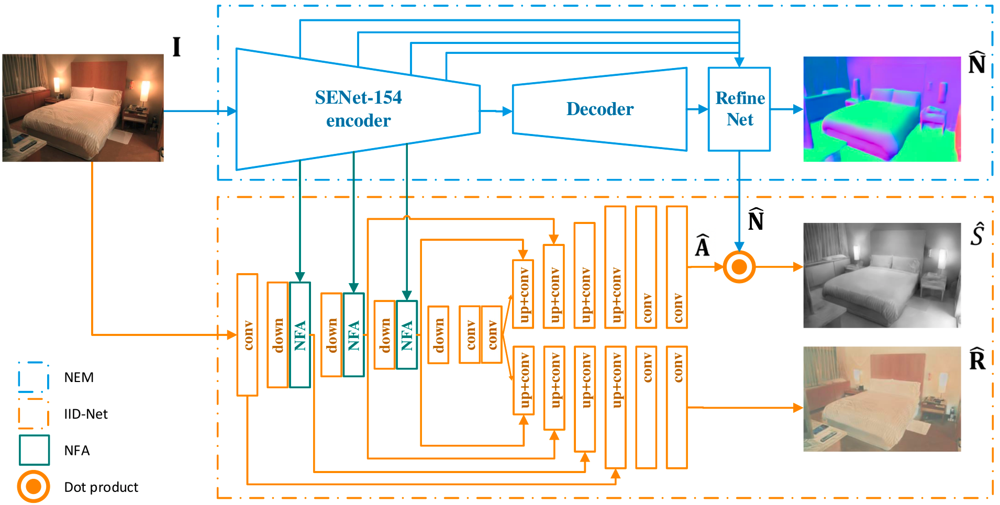
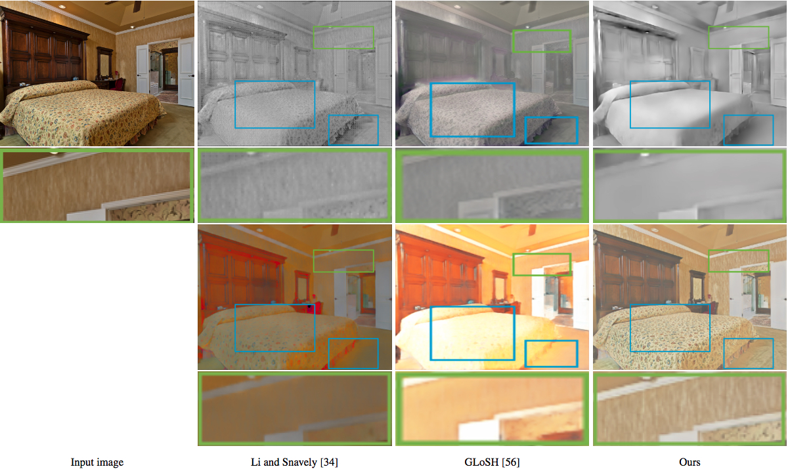
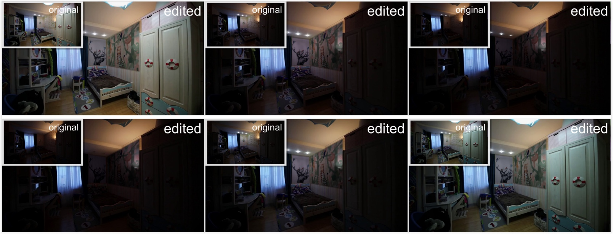

# NIID-Net: Adapting Surface Normal Knowledge for Intrinsic Image Decomposition in Indoor Scenes
[[paper]](https://ieeexplore.ieee.org/document/9199573) 
[[presentation]](https://youtu.be/EmulMTr2RQk)
[[demo]](https://youtu.be/0MadIlfqles) 
[[supplement (coming soon)]]()




Dependencies
-
+ Python 3.5
+ PyTorch 0.3.1 (read [Migration Guide](https://pytorch.org/blog/pytorch-0_4_0-migration-guide/) if you use PyTorch > 0.3.1)
+ torchvision 0.2.1
+ [Visdom](https://github.com/facebookresearch/visdom) 0.1.8.9 
+ We provide a requirements.txt file for other dependencies.

Datasets
-
#### Intrinsic image datasets
+ Follow [CGIntrinsics](https://github.com/zhengqili/CGIntrinsics) to download CGI, IIW and SAW datasets. 
Note that Z. Li and N. Snavely augment the original [IIW](http://opensurfaces.cs.cornell.edu/intrinsic/#) and [SAW](http://opensurfaces.cs.cornell.edu/saw/) datasets.
+ You may not download the CGI dataset if you are not going to train the model.
+ Put the datasets in the ```./dataset/``` folder. The final directory structure:
    ```
    NIID-Net project
    |---README.md
    |---...
    |---dataset
        |---CGIntrinsics
            |---intrinsics_final
            |   |---images   
            |   |---rendered
            |   |---...
            |---IIW
            |   |---data
            |   |---test_list
            |   |---...
            |---SAW
                |---saw_images_512
                |---saw_pixel_labels
                |---saw_splits
                |---train_list
    ```

Running
-
+ ##### Configuration
  + ```options/config.py``` is the configuration file:
    + ```TestOptions``` for test
    + ```TrainIIDOptions``` for training the IID-Net
  + Some variables may need to be modified:
    ```
      dataset_root #
      checkpoints_dir # visualized results will be saved here
      offline # if you do not need Visdom, set it True
      pretrained_file #
      gpu_devices # the indexes of GPU devices, or set None to run CPU version 
      batch_size_intrinsics # batch size for training on the CGIntrinsics dataset
    ```
  + Note that only test mode supports CPU version (with ```gpu_devices=None```). 
  We recommend you to use the **GPU** version.
+ ##### Pre-trained model
    [Google Drive](https://drive.google.com/file/d/160NzDEmC8okb6vgTNTyzmhaYa-Lqo-Ft/view?usp=sharing)
    (or [Baidu Net Disk](https://pan.baidu.com/s/1n45ZwuYZpUA8vp-9V-ca9Q) with code ```uj3n```)
    
+ ##### Demo
  + ```python decompose.py```
  + The default input and output directory is ```./examples/```
+ ##### Test
  + ```python test.py```
  + The default output directory is ```./checkpoints/```
+ ##### Train
  + (coming soon...)

Results
- 
+ Comparison

+ Image sequence editing


Acknowledgements
-
We have used/modified codes from the following projects:
  + [CGIntrinsics](https://github.com/zhengqili/CGIntrinsics):
    + codes for loading data from the CGI, SAW and IIW datasets in ```./data/intrinsics/```.
    + codes for evaluating shading and reflectance estimation in ```./test/```.
    (These codes are originally provided by [IIW](http://opensurfaces.cs.cornell.edu/intrinsic/#) 
    and [SAW](http://opensurfaces.cs.cornell.edu/saw/)) 
  + [Revisiting_Single_Depth_Estimation](https://github.com/JunjH/Revisiting_Single_Depth_Estimation):
    + the network structure of normal estimation module in ```./models/Hu_nets/```
    

Citation
-
If you find this code useful for your research, please cite:
  ```
  @article{luo2020niid,
    title={NIID-Net: Adapting Surface Normal Knowledge for Intrinsic Image Decomposition in Indoor Scenes},
    author={Luo, Jundan and Huang, Zhaoyang and Li, Yijin and Zhou, Xiaowei and Zhang, Guofeng and Bao, Hujun},
    journal={IEEE Transactions on Visualization and Computer Graphics},
    year={2020},
    publisher={IEEE}
  }
  ```

Copyright
-
```
  Copyright (c) ZJU-SenseTime Joint Lab of 3D Vision. All Rights Reserved.

  Permission to use, copy, modify and distribute this software and its
  documentation for educational, research and non-profit purposes only.

  The above copyright notice and this permission notice shall be included in all
  copies or substantial portions of the Software.

  THE SOFTWARE IS PROVIDED "AS IS", WITHOUT WARRANTY OF ANY KIND, EXPRESS OR
  IMPLIED, INCLUDING BUT NOT LIMITED TO THE WARRANTIES OF MERCHANTABILITY,
  FITNESS FOR A PARTICULAR PURPOSE AND NONINFRINGEMENT. IN NO EVENT SHALL THE
  AUTHORS OR COPYRIGHT HOLDERS BE LIABLE FOR ANY CLAIM, DAMAGES OR OTHER
  LIABILITY, WHETHER IN AN ACTION OF CONTRACT, TORT OR OTHERWISE, ARISING FROM,
  OUT OF OR IN CONNECTION WITH THE SOFTWARE OR THE USE OR OTHER DEALINGS IN THE
  SOFTWARE.
```

Contact
-
Please open an issue or contact Jundan Luo (<luojundan@zju.edu.cn>) if you have any questions or any feedback.